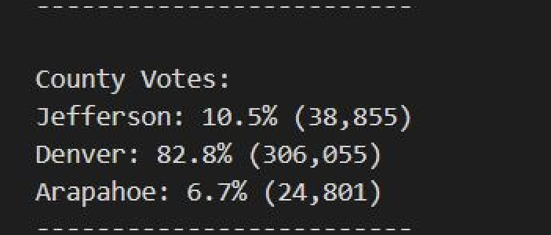
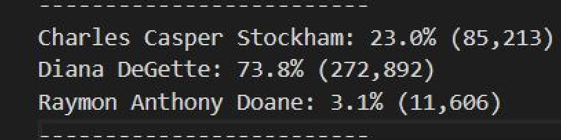
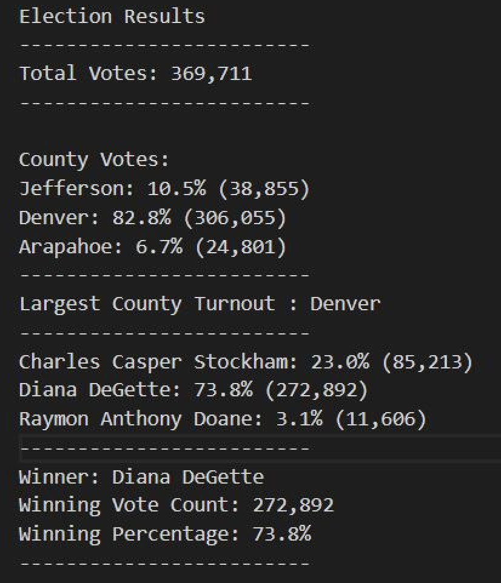
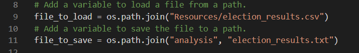
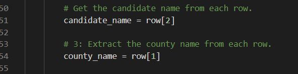

# Election Analysis

## Overview of Election Audit

The purpose of the project was to assist Tom, who is a Colorado Board of Elections employee in the audit of tabulated results for a US congressional precinct in Colorado. Using the data source of a CSV file containing the tabulated totals for the elections from various voting methods, the objective was to automate the process by writing a python script to successfully audit this election. As part of the audit to find the election winner, the following metrics were calculated: 
- Total Number of Votes cast for the election
- Total Number of Votes for each Candidate 
- The percentage of Votes for each Candidate 
- The winner of the election based on the popular vote
- The voter turnout for each county 
- The percentage of votes for each county out of the total count
- The county with the highest turnout 

After successfully completing the audit and showing the results of the election, a proposal is written on how the script can be successfully implemented in other elections.  

## Election Audit Results

After the audit of the elections using our Python script, the following outcomes were deduced:

- Total Number of Votes Cast for this congressional election: 369,711

- Total Number of Votes and percentage of total votes for each county:
  (Total votes inside parenthesis and percentage outside)

  

- The county with the largest number of Votes: Denver 

- Number of Votes and the percentage of votes each candidate received:
  (Total votes inside parenthesis and percentage outside)
 
  

- Winner of the election:
  
  

From our analysis and calculations, we have deduced that Diana DeGette is the winner of this congressional election by popular vote, receiving a total of 272,892 and 73.8% of the votes.

## Election Audit Summary

The python script written here to audit this congressional election result, helps automate calculations and will help the election board publish these results as soon as the vote counts are completed and data is available. Not only will this improve the speed at which the election audits are finalized but it will also decrease the chance of human error when using other tools such as excel to perform such calculations. This python script will not only be useful in this election but can also be used in other future elections planned by the Colorado board of elections after some slight modifications if the popular vote is used as the method for determining the winner. The modifications that can be done are as following:
  - Changing the line in the script to the appropriate path when a variable is added to load and save the path as the future election results will be stored in a different CSV       file.
    
    

  - Changing the indexing in the lines of the script used to extract candidate and county names, since the columns might be different for the data set in the election results       CSV file for the future election.
    
    

Therefore we can see that after these small modifications, this script written for this congressional election can be successfully used to audit future elections.
